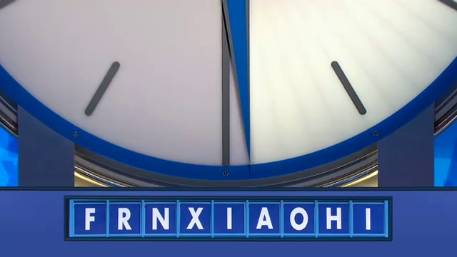
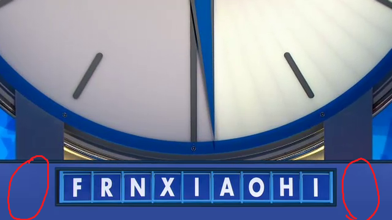

Countdown
==========

# What
This is a system that can watch [Countdown](http://www.youtube.com/watch?v=o0SrIqaplKo) (if fed the video stream for it) and then decode the letters
that are being offered, then tweet the responce in speed. The system runs at around 100FPS on a i5 Laptop
far greater then the input rate of 25 FPS from TV.

## Contained inside
Inside is the source code for the MJPEG decoder that is to be used for the input. You can feed the system a flv
by using the following command in the terminal.

`ffmpeg.exe -i ../countdowna.flv -acodec none -vcodec mjpeg -f mjpeg - | ./AutoCountdown/bin/Debug/AutoCountdown.exe`

This will take the input FLV (In the real system it is piped into ffmpeg) and have ffmpeg output a MJPEG stream.

Inside of the program is a MJPEG decoder for this use.

# How

## Input

This system uses FFMPEG for its major heavy lifting. The system takes MJPEG in.

## Detection

The system looks for frames like the following:

Each frame is evaluated for being a frame with the letters in by using the two solid parts as shown:

## Extraction

If the frame passes that test then it scanned to find the 'box' edges:

The 'box' is then processed to find the bright parts (the text) then outputted to a PNG file

This file is then passed to `tesseract` in order to do OCR, the result is then read out.

## Twitter posting

Once the winning words are calculated, `Tinytwitter` is used to post the tweet. (Patch for API 1.1 is coming.)

# Requirements

Right now there are a few hardcoded paths to things like tesseract.
While the system should run under mono, the paths for tesseract need to be fixed for that to happen.